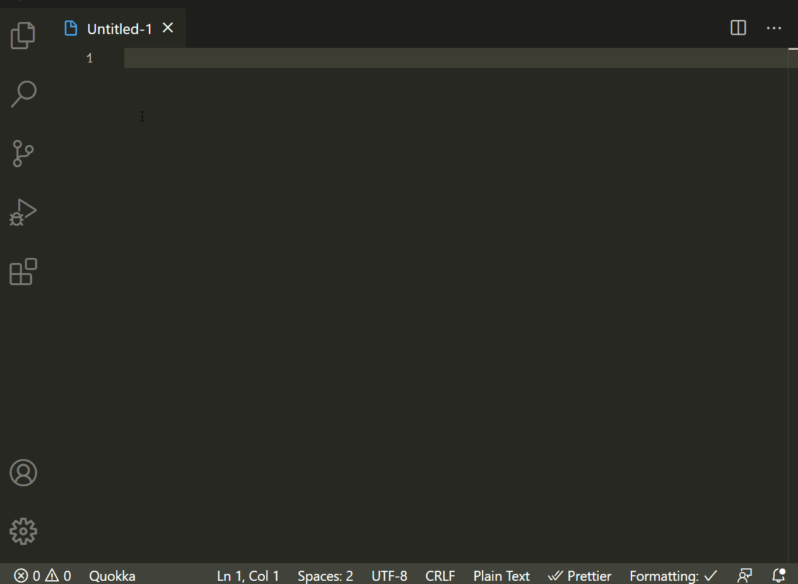
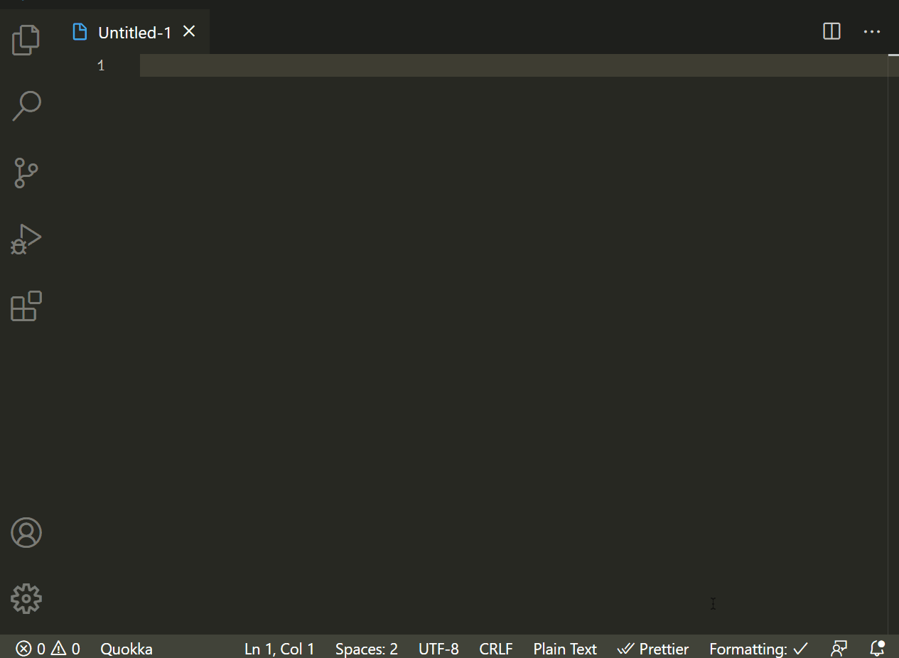

# ShakespeareLoremIpsum

Press macOS: `Command+Shift+P`. Windows: `Ctrl+Shift+P` , search for the `LoremIpsumDocet` command and generate your random shakespearan text.

## Features

Generate random shakespearan text as your lorem ipsum for your next gen apps.

## Release Notes

This is my first VS code extension built by me 1.5 hours before my birthday,so kinda a birthday present for me
